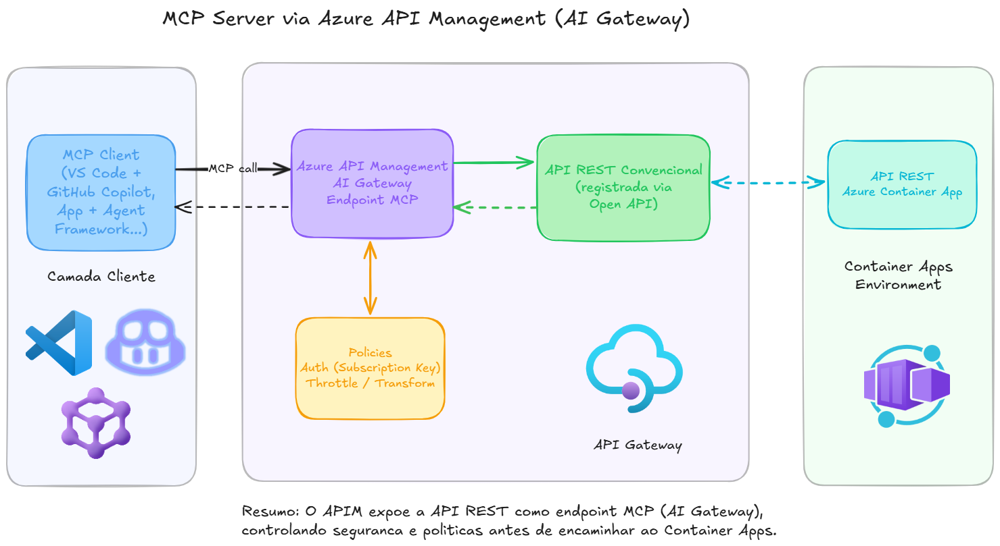

# azureapim-openapi-mcp
Exemplo de exposição via Azure API Management de uma API REST convencional (baseada em OpenAPI) como um MCP Server. Exemplo baseado em uma aplicação containerizada publicada através do Azure Container Apps.

Referência: https://learn.microsoft.com/en-us/azure/api-management/genai-gateway-capabilities

Aplicação utilizada como base para os testes: https://github.com/renatogroffe/aspnetcore10-minimalapis-appinsights-otel-scalar_contagemacessos-simulacaofalhas

Live em que este conteúdo foi apresentado: https://www.youtube.com/watch?v=KprGEuSUlpg

Arquitetura deste tipo de solução:

Tecnologias/serviços utilizados:
- Azure API Management
- Azure Container Apps
- GitHub Copilot
- Visual Studio Code
- Application Insights

OBS.: Este diagrama foi adaptado a partir de uma versão inicial gerada via [MCP Server do Excalidraw](https://learn.microsoft.com/en-us/azure/api-management/genai-gateway-capabilities).
